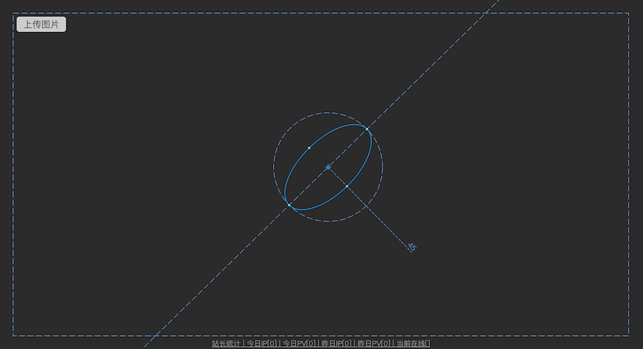

# bone-measure
 
> It's simple , may be used in medicine , but I'm not sure

## preview

# Installing :

Installation via `npm`:

     npm install

 
## Usage:

     npm start
 
*Now you can visit http://localhost:8080 to view your server*
